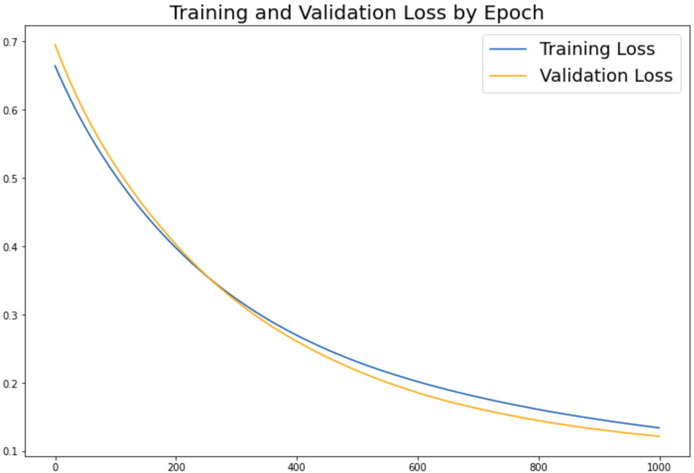
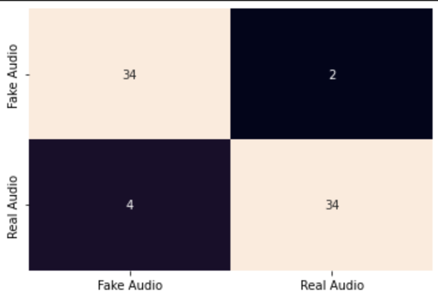

[//]: # (____________________________________PROJECT TITLE____________________________________)

 

<h1 align="center">
   
Voice Cloning and Fake Audio Detection
</h1>

    

[//]: # (____________________________________BACKGROUND____________________________________)

## Background:

We are a technology company working in the Cyber Security industry. We focus on building systems that help individuals and organizations to have safe and secure digital presence by providing cutting edge technologies to our customers. We create products and services that ensure our customers security using data driven technologies to understand whether audio and video media is authentic or fake.

Our goal in this project is to build algorithms that can synthesize spoken audio by converting a speaker’s voice to another speaker’s voice with the end goal to detect if any spoken audio is pristine or fake.

  

[//]: # (____________________________________DATA DESCRIPTION____________________________________)

## Data Description:

There are two datasets you can utilize in this project. Both datasets are publicly available sources.

- TIMIT Dataset:

The TIMIT corpus of read speech is designed to provide speech data for acoustic-phonetic studies and for the development and evaluation of automatic speech recognition systems. TIMIT contains a total of 6300 sentences, 10 sentences spoken by each of 630 speakers from 8 major dialect regions of the United States.

Dataset Link: https://github.com/philipperemy/timit

- CommonVoice Dataset:

Common Voice is part of Mozilla's initiative to help teach machines how real people speak. Common Voice is a corpus of speech data read by users on the Common Voice website (https://commonvoice.mozilla.org/), and based upon text from a number of public domain sources like user submitted blog posts, old books, movies, and other public speech corpora. Its primary purpose is to enable the training and testing of automatic speech recognition (ASR) systems.

Dataset Link: https://commonvoice.mozilla.org/en/datasets

  

[//]: # (____________________________________COAL____________________________________)

## Goal(s):

Build a machine learning system to detect if a spoken audio is synthetically generated or not. In order to achieve this, first, build a voice cloning system given a speaker’s spoken audio that clones the source speaker’s voice to the target speaker’s voice. Next, build a machine learning system which detects if any spoken audio is a natural speech or synthetically generated by machine.

  

[//]: # (____________________________________PROJECT OVERVIEW____________________________________)

## Project Overview:

### 1) Experimentation with the audio cloning with four different techniques:

- Short Audio with a short text
- Short Audio with a long text.
- Long Audio with a short text.
- Long Audio with a long text.

Before explaining each technique, we need to know that, in the TIMIT data we have train and test data, in each dataset we have **168** speakers with 10 short audio files **(around 4s)**. 

In `"Short Audio with a short text"`, the original files have been cloned with one short sentence, and in `"Short Audio with a long text"`, the same files have been cloned but with two-sentence instead of one to have a longer sentence and to see how the cloning model will works.

On the other hand, both the `"Long Audio with a short text"` and `"Long Audio with a long text"`, are using different versions of the audio files. As mentioned before, we have **168** speakers which mean **336** in total. Each speaker's audio files have been merged into one file and cloned later. Both of the techniques use a short sentence and a longer one to see how the cloning model will work. Here are three samples that are used in the long audio version:

### 2) Voice Cloning:
After cloning three samples in each technique, the third one has been chosen -Long audio with a short sentence- and all of the **336** files have been cloned and saved.

The third technique has been chosen based on how accurate the model is to convert the text to speech. This was done by converting the cloned audio to the text again and calculating the similarity between the original text and the one from the cloned audio.

### 3) The Classifier:

In the classifier, two techniques are used: 
1) Real audio data VS. Cloned audio data. 
2) Real audio data VS. Cloned audio data with removing the noise.

In the first technique, the classifier perfectly distinguishes between both classes. In the second one, the classifier makes 6 false predictions, 2 for classifying fake audios as real and the rest for classifying real audios as fake.

 

Train VS. val loss for `Real audio data VS. Cloned audio data with removing the noise`

  

 

Confusion matrix for `Real audio data VS. Cloned audio data with removing the noise`

  

[//]: # (____________________________________ CONCLUSION____________________________________)

## Conclusion:

In this project, voices cloning has been done, to me and to my hearing some of the cloned audios seem like a real one or a real person but with noise in the background, even with this, the machine can classify both of the classes perfectly or with high accuracy if we remove the noise. In general, more samples for each speaker lead to more accurate cloning.  

